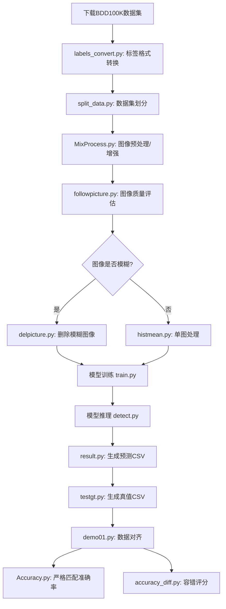

# 行人车辆检测与计数模型训练与设计

[](https://www.python.org/)
[](https://pytorch.org/)
[](https://fastapi.tiangolo.com/)
[](https://vuejs.org/)
[](https://github.com/ultralytics/yolov5)

基于 YOLOv5 的城市道路自动驾驶行人车辆检测与计数系统模型的训练，内置yolov5模型，如果内置别的模型处理逻辑一致，随后将推进与yolov26等模型的训练。

## 项目简介

本项目是一个完整的行人车辆检测与计数系统，专为城市道路自动驾驶场景设计。系统基于 BDD100K 数据集，使用 YOLOv5 深度学习框架，提供从数据预处理、模型训练、模型推理到结果可视化的全流程解决方案。

### 功能特性

- **图像检测**：上传单张或多张图片进行行人车辆检测
- **视频检测**：上传视频文件进行实时目标检测与跟踪
- **摄像头检测**：实时摄像头画面检测，适用于边缘计算设备
- **模型训练**：通过 Web 界面配置参数并启动 YOLOv5 模型训练
- **结果管理**：查看、下载检测结果和训练指标
- **系统监控**：实时监控 CPU、内存和 GPU 使用情况

### 检测类别

| 类别ID | 类别名称 | 描述 |
|--------|----------|------|
| 0 | bus | 公交车 |
| 1 | traffic light | 交通灯 |
| 2 | traffic sign | 交通标志 |
| 3 | person | 行人 |
| 4 | bike | 自行车 |
| 5 | truck | 卡车 |
| 6 | motor | 摩托车 |
| 7 | car | 汽车 |
| 8 | rider | 乘车人 |

## 项目结构

```
BDD_contest/
├── backend/                 # FastAPI 后端服务
│   ├── main.py             # 后端主程序
│   ├── requirements.txt    # Python 依赖
│   ├── start_backend.ps1   # 后端启动脚本
│   └── state/              # 任务状态存储
├── frontend/               # Vue.js 前端应用
│   ├── src/                # 前端源代码
│   │   ├── api/            # API 接口
│   │   ├── pages/          # 页面组件
│   │   ├── router/         # 路由配置
│   │   └── stores/         # 状态管理
│   ├── package.json        # Node.js 依赖
│   ├── start_frontend.ps1  # 前端启动脚本
│   └── vite.config.ts      # Vite 配置
├── yolov5-6.2/             # YOLOv5 核心代码
│   └── datasets/           # 数据集文件夹 (含详细文档)
├── labels_convert.py       # 标签格式转换脚本 (BDD格式 → YOLO格式)
├── split_data.py           # 数据集划分脚本 (train/val/test)
├── result.py               # 检测结果统计脚本 (生成预测CSV)
├── testgt.py               # 真值统计脚本 (生成Ground Truth CSV)
├── Accuracy.py             # 准确率计算脚本 (严格匹配)
├── accuracy_diff.py        # 差异计分脚本 (容错评分)
├── demo01.py               # 数据同步脚本 (对齐预测和真值数据)
├── MixProcess.py           # 批量图像预处理脚本 (数据增强)
├── followpicture.py        # 图像质量评估脚本 (模糊度检测)
├── histmean.py             # 单图像预处理脚本 (去噪增强)
├── delpicture.py           # 模糊图像删除脚本 (自动清理)
└── test_api.py             # API 测试脚本
```

## 环境要求

### 硬件要求

- **CPU**: 支持 Intel/AMD x86_64 处理器
- **GPU**: NVIDIA GPU (推荐，可选)，支持 CUDA 11.x
- **内存**: 8GB RAM (推荐 16GB+)
- **存储**: 至少 20GB 可用空间

### 软件要求

- **Python**: 3.9+ (推荐 3.10)
- **Node.js**: 16+ (推荐 18+)
- **操作系统**: Windows 10/11, Linux, macOS

## 快速开始

### 1. 安装后端依赖

```bash
# 克隆项目后，进入项目根目录
cd BDD_contest

# 创建并激活虚拟环境 (可选)
python -m venv .venv
# Windows
.venv\Scripts\activate
# Linux/macOS
# source .venv/bin/activate

# 安装后端依赖
pip install -r backend/requirements.txt

# 安装 PyTorch (根据你的硬件选择)
# GPU 版本 (CUDA 11.8)
pip install torch torchvision torchaudio --index-url https://download.pytorch.org/whl/cu118
# CPU 版本
pip install torch torchvision torchaudio --index-url https://download.pytorch.org/whl/cpu

# 安装 YOLOv5 依赖
pip install -r yolov5-6.2/requirements.txt
```

### 2. 安装前端依赖

```bash
cd frontend
npm install
```

### 3. 启动服务

**启动后端服务** (端口 8000):
```bash
cd backend
.\start_backend.ps1
# 或手动启动
python -m uvicorn main:app --host 0.0.0.0 --port 8000 --reload
```

**启动前端服务** (端口 5173):
```bash
cd frontend
.\start_frontend.ps1
# 或手动启动
npm run dev
```

### 4. 访问系统

打开浏览器访问：`http://localhost:5173`

## 数据集准备

### 下载 BDD100K 数据集

本项目使用 BDD100K 数据集进行训练和评估。

- **TrainA 数据集**: [百度网盘下载]( https://pan.baidu.com/s/17sLJV1Ru5ZiBV1pyFl1_EQ?pwd=cq8i) (提取码: cq8i)
- **TrainB 数据集**: [百度网盘下载]( https://pan.baidu.com/s/1C19R4ZjNnvkZ0CU8gMXkUg?pwd=sfqf 
  ) (提取码: sfqf)

### 数据预处理

1. **标签格式转换**: 将原始标签转换为 YOLO 格式
   ```bash
   python labels_convert.py
   ```

2. **数据集划分**: 按 8:1:1 划分训练集、验证集和测试集
   ```bash
   python split_data.py
   ```

### 数据集结构

```
datasets/
├── images/
│   ├── train/    # 训练集图片
│   ├── val/      # 验证集图片
│   └── test/     # 测试集图片
└── labels/
    ├── train/    # 训练集标签
    ├── val/      # 验证集标签
    └── test/     # 测试集标签
```

## 工具脚本说明

本项目提供了一系列辅助脚本，覆盖从数据预处理、质量评估到结果评估的完整流程。

### 数据预处理脚本

#### 1. labels_convert.py - 标签格式转换

**功能**: 将 BDD100K 原始标签格式转换为 YOLO 格式

**原始格式**: `类别ID x_min y_min x_max y_max` (绝对坐标)

**YOLO格式**: `类别ID x_center y_center width height` (归一化坐标)

**使用方法**:
```bash
python labels_convert.py
```

**参数配置**:
```python
# 修改脚本中的路径配置
label_directory = 'trainB/labels/label-trainB'  # 标签文件夹路径
img_width = 1280   # 图片宽度
img_height = 720   # 图片高度
```

---

#### 2. split_data.py - 数据集划分

**功能**: 按指定比例将数据集划分为训练集、验证集和测试集

**划分比例**: 默认 8:1:1 (训练集:验证集:测试集)

**使用方法**:
```bash
python split_data.py
```

**参数配置**:
```python
image_folder_path = "trainA/images"                    # 原始图片路径
txt_folder_path = "trainA/labels/label-trainA"        # 原始标签路径
output_dataset_path = "yolov5-6.2/datasets"           # 输出路径
split_ratio = (0.8, 0.1, 0.1)                         # 划分比例
```

---

#### 3. MixProcess.py - 批量图像预处理

**功能**: 批量对图像进行多种预处理操作，支持数据增强

**支持的操作**:
- 灰度转换
- 尺寸调整
- 去噪处理 (高斯模糊 + 中值滤波)
- 亮度调整
- 对比度增强 (CLAHE)
- 色彩增强 (HSV 空间)
- 图像锐化
- 直方图均衡化
- 随机亮度和对比度调整
- 随机旋转
- 随机裁剪
- 边缘检测
- 像素归一化

**使用方法**:
```bash
python MixProcess.py
```

**参数配置**:
```python
input_folder = './yolov5-6.2/datasets/images/train'  # 输入文件夹
output_folder = './yolov5-6.2/datasets/images/train' # 输出文件夹

# 启用需要的预处理操作
grayscale = False                    # 灰度转换
resize = (1280, 720)                # 调整尺寸
noise_reduction = True              # 去噪
brightness_adjustment = 0           # 亮度调整
contrast_enhancement = False        # 对比度增强
color_enhancement = False           # 色彩增强
sharpen_image = False               # 锐化
histogram_equalization = False      # 直方图均衡化
random_brightness_contrast = False  # 随机亮度对比度
random_rotate_angle_range = (-10, 10) # 随机旋转角度
random_crop_ratio_range = (0, 0)    # 随机裁剪比例
edge_detection = False              # 边缘检测
normalize = True                    # 归一化
```

---

#### 4. histmean.py - 单图像预处理

**功能**: 对单张图像进行预处理，支持去噪和增强

**支持的操作**:
- 灰度转换
- 尺寸调整
- 高斯噪声去除 (均值滤波)
- 椒盐噪声去除 (中值滤波)
- 直方图均衡化

**使用方法**:
```bash
python histmean.py
```

**参数配置**:
```python
input_image_dir = "./yolov5-6.2/datasets/images/val"  # 图像文件夹

# 处理参数
grayscale = True                           # 转灰度图
resize = (640, 640)                        # 调整尺寸
histogram_equalization = True              # 直方图均衡化
remove_gaussian_noise = True               # 去除高斯噪声
remove_salt_pepper_noise = True            # 去除椒盐噪声
```

---

### 图像质量评估脚本

#### 5. followpicture.py - 图像质量评估

**功能**: 批量评估图像质量，检测模糊图像

**评估指标**:
- **拉普拉斯方差 (Laplacian Variance)**: 值越大表示图像越清晰
- **Tenengrad 算子**: 基于梯度的清晰度评估
- **信息熵 (Entropy)**: 图像信息量评估

**使用方法**:
```bash
python followpicture.py
```

**参数配置**:
```python
directory = './yolov5-6.2/datasets/images/train'      # 图片文件夹
labels_directory = './yolov5-6.2/datasets/labels/train'  # 标签文件夹
```

**输出示例**:
```
图片: train_A_1.jpg
  拉普拉斯变差 : 156.32
  Tenengrad算子: 89.45
  熵: 7.23
```

---

#### 6. delpicture.py - 模糊图像自动删除

**功能**: 基于质量评估指标，自动删除模糊图像及其标签

**删除条件**:
- 拉普拉斯方差 < 阈值
- Tenengrad 值 < 阈值

**使用方法**:
```bash
python delpicture.py
```

**参数配置**:
```python
directory = './yolov5-6.2/datasets/images/val'        # 图片文件夹
labels_directory = './yolov5-6.2/datasets/label/val'  # 标签文件夹

# 模糊判断阈值 (需根据实际情况调整)
laplacian_threshold = 110    # 拉普拉斯方差阈值
tenengrad_threshold = 40     # Tenengrad 阈值
delete_blurry = True         # 是否删除模糊图像
```

**注意**: 删除前建议先用 `followpicture.py` 查看质量指标，确定合适的阈值。

---

### 结果评估脚本

#### 7. result.py - 预测结果统计

**功能**: 将 YOLO 检测结果的 txt 标签文件转换为计数 CSV 文件

**统计规则**:
- **行人数量 (people_num)**: 类别 3 (person) + 类别 8 (rider)
- **车辆数量 (vehicle_num)**: 类别 0 (bus) + 4 (bike) + 5 (truck) + 6 (car) + 7 (motor)

**输出格式**:
```csv
image_name,people_num,vehicle_num
train_A_1506,1,17
train_A_1548,1,10
train_A_1550,2,16
```

**使用方法**:
```bash
python result.py
```

**参数配置**:
```python
label_dir = r"E:\BDD_contest\yolov5-6.2\runs\detect\exp2\labels"  # YOLO检测输出标签路径
output_csv = r"E:\BDD_contest\label_contest\test_submission.csv"  # 输出CSV路径
```

---

#### 8. testgt.py - 真值统计

**功能**: 从原始数据集标签生成 Ground Truth CSV 文件

**使用方法**: 与 `result.py` 相同，仅需修改路径配置

**参数配置**:
```python
label_dir = r"E:\BDD_contest\yolov5-6.2\datasets\labels\test"    # 数据集标签路径
output_csv = r"E:\BDD_contest\label_contest\testgt_submission.csv" # 输出CSV路径
```

---

#### 9. demo01.py - 数据同步

**功能**: 对齐预测结果和真值数据，确保两个 CSV 文件的 image_name 完全对应

**处理逻辑**:
1. 将真值中存在但预测中缺失的行追加到预测文件
2. 删除预测中存在但真值中没有的行
3. 按 image_name 排序确保数据对齐

**使用方法**:
```bash
python demo01.py
```

**参数配置**:
```python
df1 = pd.read_csv('./label_contest/test_submission.csv')      # 预测结果
df2 = pd.read_csv('./label_contest/testgt_submission.csv')    # 真值数据
```

**注意**: 运行此脚本后再执行准确率计算，避免因数据不对齐导致错误。

---

#### 10. Accuracy.py - 准确率计算 (严格匹配)

**功能**: 计算预测结果与真值的完全匹配准确率

**评分标准**: 行人数量和车辆数量都完全一致才算正确

**使用方法**:
```bash
python Accuracy.py
```

**参数配置**:
```python
submission_path = r"E:\BDD_contest\label_contest\test_submission.csv"      # 预测结果
ground_truth_path = r"E:\BDD_contest\label_contest\testgt_submission.csv"  # 真值数据
```

**输出示例**:
```
Overall accuracy: 14.92%
```

---

#### 11. accuracy_diff.py - 差异计分 (容错评分)

**功能**: 基于计数差异进行容错评分，更符合实际应用场景

**评分标准**:

| 差异绝对值 | 行人得分 | 车辆得分 |
|-----------|---------|---------|
| 0 | 0.10 | 0.10 |
| 1 | 0.09 | 0.095 |
| 2 | 0.075 | 0.09 |
| 3 | 0.055 | 0.085 |
| ≤5 | 0.03 | 0.055 |
| ≤7 | 0 | 0.03 |
| >7 | 0 | 0 |

**总分计算**: `总分 = Σ(0.4 × 行人得分 + 0.6 × 车辆得分)`

**使用方法**:
```bash
python accuracy_diff.py
```

**参数配置**: 与 `Accuracy.py` 相同

---

## 完整工作流程

以下是从数据准备到结果评估的完整流程：



### 快速上手

```bash
# 1. 标签转换
python labels_convert.py

# 2. 划分数据集
python split_data.py

# 3. 图像预处理 (可选)
python MixProcess.py

# 4. 质量评估 (可选)
python followpicture.py

# 5. 模型训练 (在 yolov5-6.2 目录下)
cd yolov5-6.2
python train.py --img 640 --batch 16 --epochs 100 \
  --data data/bdd_traina.yaml \
  --cfg models/yolov5s.yaml \
  --weights yolov5s.pt

# 6. 模型推理
python detect.py --source ../datasets/images/test \
  --weights runs/train/exp/weights/best.pt \
  --save-txt --save-conf

# 7. 结果统计
cd ..
python result.py
python testgt.py

# 8. 数据对齐
python demo01.py

# 9. 准确率计算
python Accuracy.py
python accuracy_diff.py
```

## 模型训练

### 配置训练参数

在 `yolov5-6.2/data/` 目录下创建 `bdd_traina.yaml` 文件：

```yaml
path: /path/to/datasets  # 数据集根目录
train: images/train      # 训练集图片路径
val: images/val          # 验证集图片路径
test: images/test        # 测试集图片路径 (可选)

# 类别定义
nc: 9                    # 类别数量
names: ['bus', 'traffic light', 'traffic sign', 'person', 'bike', 
        'truck', 'motor', 'car', 'rider']
```

### 下载预训练模型

从 [YOLOv5 官方仓库](https://github.com/ultralytics/yolov5/releases) 下载预训练模型：

| 模型 | 大小 | 适用场景 |
|------|------|----------|
| yolov5n.pt | 1.9MB | 移动端部署 |
| yolov5s.pt | 7.2MB | CPU 推理 |
| yolov5m.pt | 21.2MB | 平衡速度与精度 |
| yolov5l.pt | 46.5MB | 高精度检测 |
| yolov5x.pt | 86.7MB | 最高精度 |

### 开始训练

通过 Web 界面配置训练参数并启动训练，或直接在命令行运行：

```bash
cd yolov5-6.2
python train.py --img 640 --batch 16 --epochs 100 \
  --data data/bdd_traina.yaml \
  --cfg models/yolov5s.yaml \
  --weights yolov5s.pt \
  --device 0
```

### 训练参数说明

| 参数 | 说明 | 默认值 |
|------|------|--------|
| --weights | 预训练模型路径 | yolov5s.pt |
| --cfg | 模型配置文件路径 | - |
| --data | 数据集配置文件路径 | - |
| --epochs | 训练轮数 | 100 |
| --batch-size | 批次大小 | 16 |
| --imgsz | 输入图片尺寸 | 640 |
| --device | 运行设备 (cpu/0/0,1,2,3) | - |
| --workers | 数据加载进程数 | 8 |

## 模型推理

### 图像检测

通过 Web 界面上传图片，或使用命令行：

```bash
cd yolov5-6.2
python detect.py --source /path/to/images \
  --weights runs/train/exp/weights/best.pt \
  --conf-thres 0.25 \
  --iou-thres 0.45 \
  --save-txt --save-conf
```

### 视频检测

```bash
python detect.py --source /path/to/video.mp4 \
  --weights runs/train/exp/weights/best.pt
```

### 摄像头实时检测

```bash
python detect.py --source 0 \
  --weights runs/train/exp/weights/best.pt
```

### 导出检测结果为 CSV

```bash
python result.py
```

### 计算准确率

```bash
python Accuracy.py
```

## 模型导出与部署

YOLOv5 支持多种导出格式，适用于不同部署场景：

```bash
cd yolov5-6.2
python export.py --weights runs/train/exp/weights/best.pt \
  --include onnx torchscript openvino engine \
  --imgsz 640 640 \
  --device 0
```

支持的导出格式：
- **ONNX**: 适用于通用部署
- **TensorRT**: NVIDIA GPU 高性能推理
- **OpenVINO**: Intel CPU/GPU 推理
- **CoreML**: Apple 设备推理
- **TorchScript**: PyTorch C++ 部署

## API 文档

后端基于 FastAPI 提供 RESTful API，启动后可访问 `http://localhost:8000/docs` 查看完整 API 文档。

### 主要接口

| 接口 | 方法 | 说明 |
|------|------|------|
| `/api/train/start` | POST | 启动训练任务 |
| `/api/train/status` | GET | 查询训练状态 |
| `/api/detect/image` | POST | 图像检测 |
| `/api/detect/video` | POST | 视频检测 |
| `/api/detect/webcam/start` | POST | 启动摄像头检测 |
| `/api/detect/webcam/stop` | POST | 停止摄像头检测 |
| `/api/results/list` | GET | 获取结果列表 |
| `/api/system/stats` | GET | 系统状态信息 |
| `/api/classes` | GET | 获取类别信息 |

## 性能指标

训练完成后，模型在验证集上的典型性能指标：

| 指标 | 数值 |
|------|------|
| Precision (P) | ~0.697 |
| Recall (R) | ~0.492 |
| mAP@0.5 | ~0.544 |
| mAP@0.5:0.95 | ~0.295 |

> 注：以上指标基于 YOLOv5s 模型，30 个 epochs 训练结果。通过增加训练轮数、使用更大模型或改进数据增强策略，可以进一步提升模型性能。

## 常见问题

### 1. numpy.int 报错

**错误**: `AttributeError: module 'numpy' has no attribute 'int'`

**解决**: 降级 numpy 版本
```bash
pip install numpy==1.23
```

### 2. torchvision NMS 报错

**错误**: `NotImplementedError: Could not run 'torchvision::nms' with arguments from the 'CUDA' backend'`

**解决**: 检查 PyTorch 和 torchvision 版本是否匹配，或重新安装对应 CUDA 版本的 torchvision。

### 3. Pillow getsize 报错

**错误**: `FreeTypeFont' object has no attribute 'getsize'`

**解决**: 
- 方法一：降级 Pillow 版本
  ```bash
  pip install pillow==9.5.0
  ```
- 方法二：修改代码，将 `getsize` 替换为 `getbbox`

### 4. 显存不足

**解决**: 
- 减小 `--batch-size` 参数
- 减小 `--imgsz` 参数
- 设置 `--workers 0`

## 项目改进建议

如果模型准确率不理想，可以尝试以下改进方法：

1. **数据增强**: 应用随机裁剪、旋转、翻转、色彩调整等技术
2. **模型选择**: 尝试更大的模型 (YOLOv5m/l/x)
3. **超参数调优**: 调整学习率、锚框大小、训练轮数等
4. **损失函数优化**: 处理类别不平衡问题
5. **后处理优化**: 调整 NMS 参数和置信度阈值

## 许可证

本项目基于 MIT 许可证开源。详见 [LICENSE](LICENSE) 文件。

YOLOv5 基于 GPL-3.0 许可证，详见 [yolov5-6.2/LICENSE](yolov5-6.2/LICENSE)。

## 引用

- YOLOv5: https://github.com/ultralytics/yolov5
- BDD100K 数据集: https://bdd-data.berkeley.edu/
- PyTorch: https://pytorch.org/

## 联系方式

如有问题或建议，欢迎通过以下方式联系：

- **邮箱**: [2102353304@qq.com](mailto:2102353304@qq.com)
- **微信公众号**: 不会写代码的小新手
- **GitHub**: 欢迎提 [Issue](https://github.com/your-username/BDD_contest/issues) 或 [Pull Request](https://github.com/your-username/BDD_contest/pulls)

---

**祝你在自动驾驶和计算机视觉领域取得成功！**
